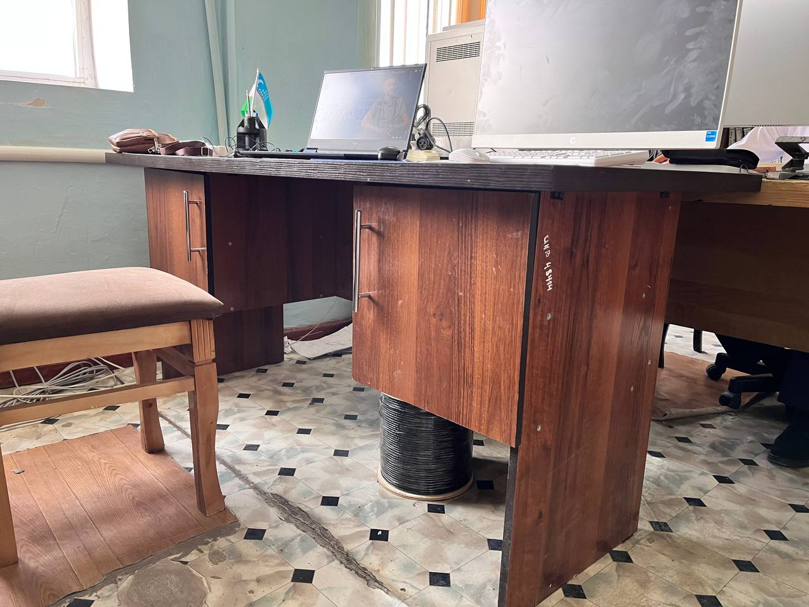

<!DOCTYPE html>
<html lang="ru">
<head>
    <meta charset="UTF-8">
    <meta name="viewport" content="width=device-width, initial-scale=1.0">
    <title>Фотография с описанием</title>
    
</head>
<body>

    <h1>№ Инвентаря 48414</h1>

    <!-- Загрузка фотографии -->
    

    <!-- Текстовое описание -->
    

       Стол деревянный.
    

</body>
</html>
